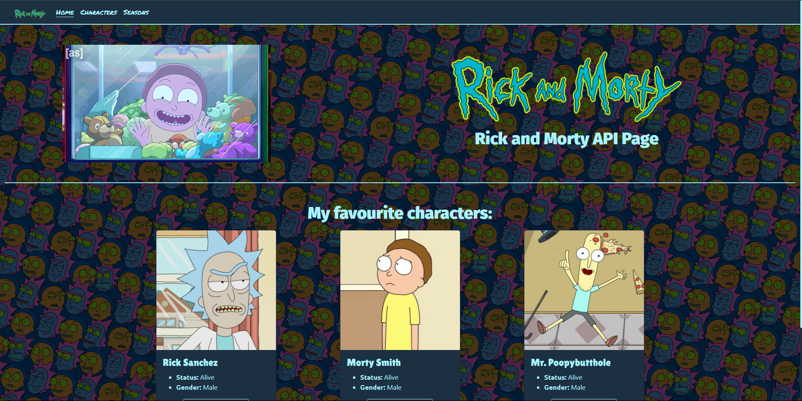
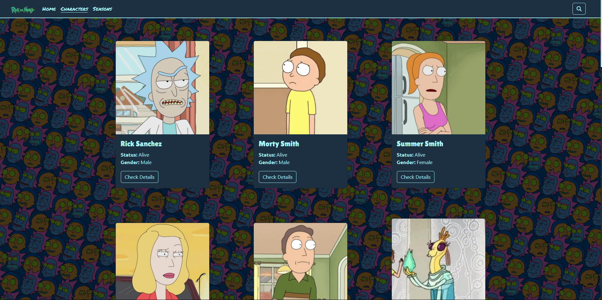
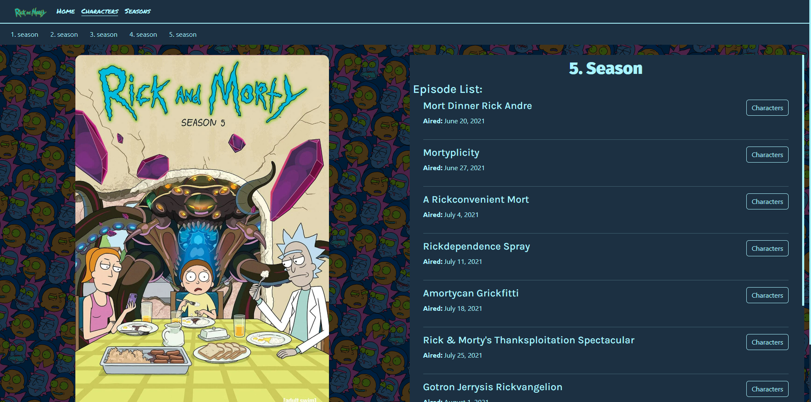

# Rick and Morty API Page

## Versions:
- [Simple version](alap/)
- [Angular version](angular/)

## Sources:
- API Source: [https://rickandmortyapi.com/documentation](https://rickandmortyapi.com/documentation)
- Angular Document: [https://angular.dev/](https://angular.dev/)
- Typescript Document: [https://www.typescriptlang.org/docs/](https://www.typescriptlang.org/docs/)
- Bootstrap Document: [https://getbootstrap.com/](https://getbootstrap.com/)

### Fonts:
- [Lilita One](https://fonts.google.com/specimen/Lilita+One?query=Lilita+One)
- [Permanent Marker](https://fonts.google.com/specimen/Permanent+Marker?query=Permanent+Marker)
- [Ubuntu](https://fonts.google.com/specimen/Ubuntu?query=Ubuntu)
- [Fira Sans](https://fonts.google.com/specimen/Fira+Sans?query=Fira+Sans)
- [Karla](https://fonts.google.com/specimen/Karla?query=Karla)

### Color Pallettes:
- [https://www.color-hex.com/color-palette/1025591](https://www.color-hex.com/color-palette/1025591 )
- [https://www.color-hex.com/color-palette/10375](https://www.color-hex.com/color-palette/10375)

## Appearance:
### Homepage:

### Character List:

### Season Page: 

# Contact
* [Facebook](https://www.facebook.com/halmai.bence.5?locale=hu_HU)
* [Linked in](https://www.linkedin.com/in/halmai-bence-5264062a4/)
* Email: sulisdolgok8@gmail.com
